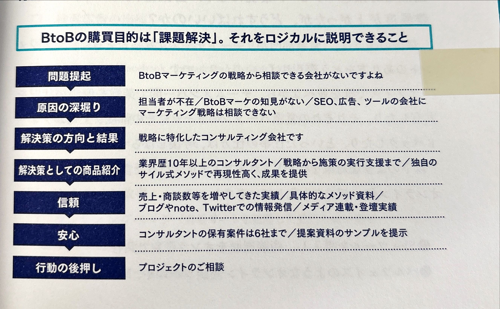

# 付箋メモ 03

## 付箋のある箇所

> BtoBの購買目的は「課題解決」。それがロジカルに説明できること。

## 参考画像（本の表）

## なぜ上司は重要と思ったのか（自分の推測）

課題解決をしてあげる脳で動かないと購買につながらないため

## 今の自分の仕事との接点

海外輸出においてはトランジットによって鮮度が落ちてる可能性を指摘し、トランジットなしの輸出で行った

## 生まれた問い

自社の商品・サービスは「どの課題を解決するか」がロジカルに説明できるか？

## 試せる実践アイデア

ロジカルに説明できるように考え伝える練習をする
